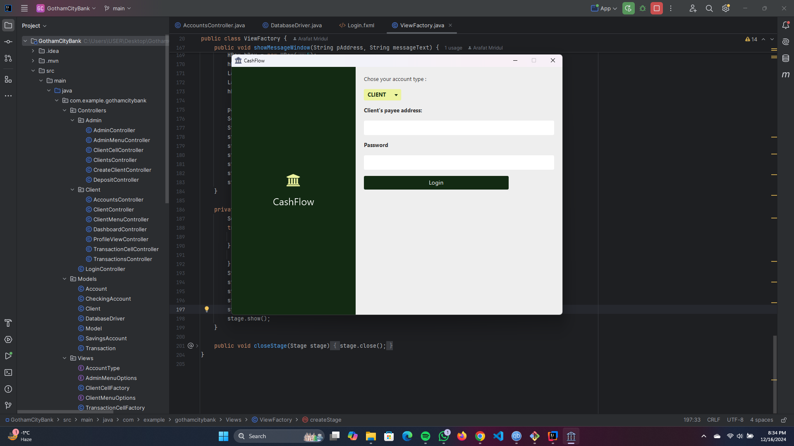
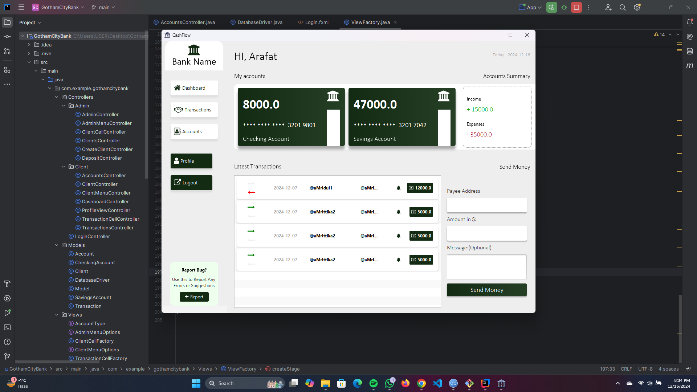
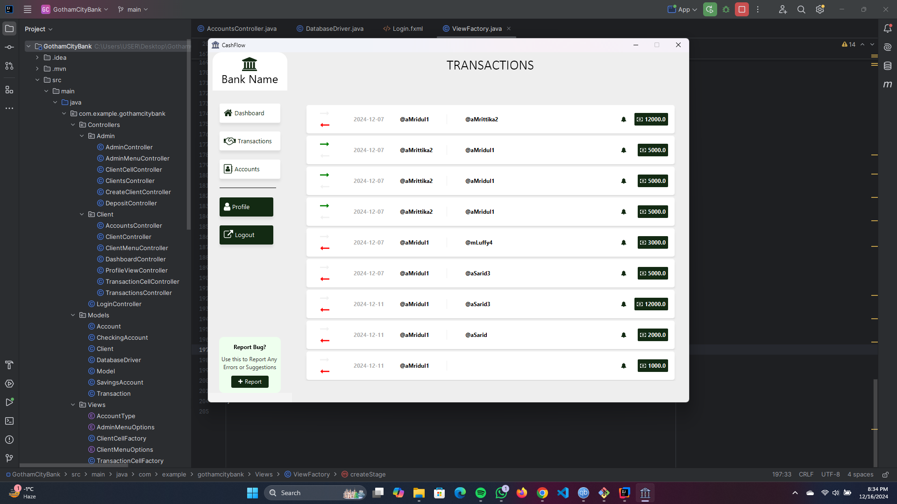
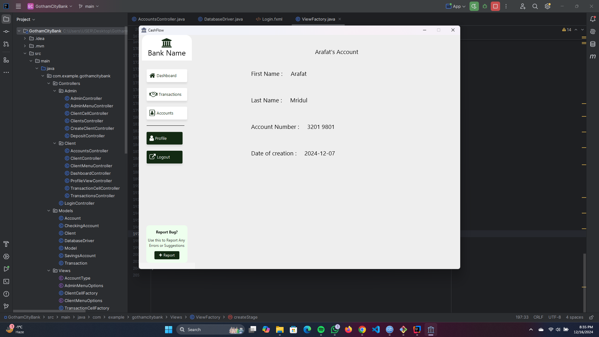
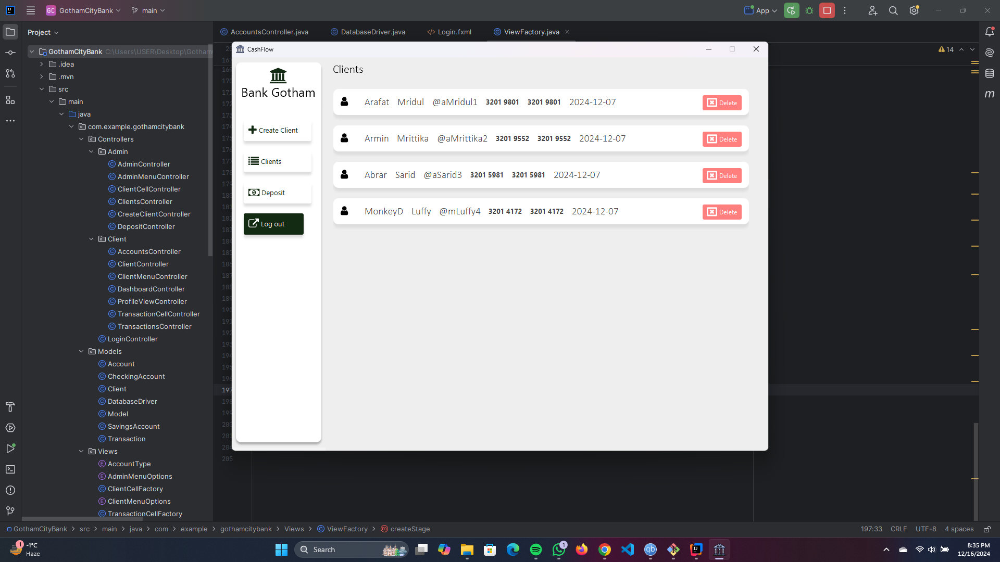
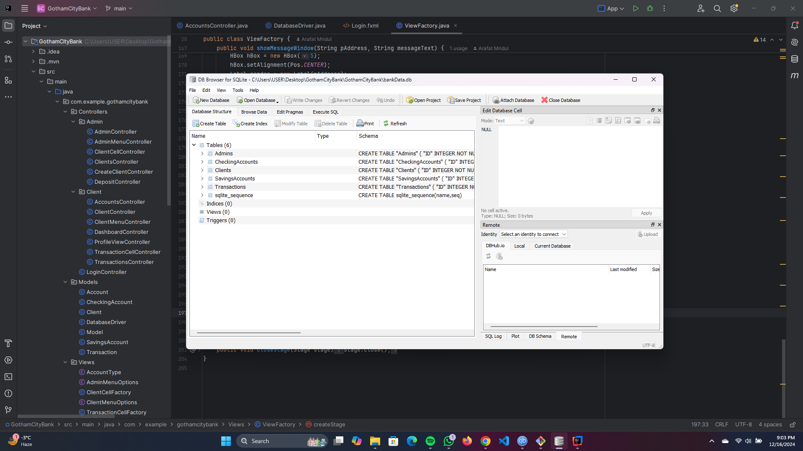
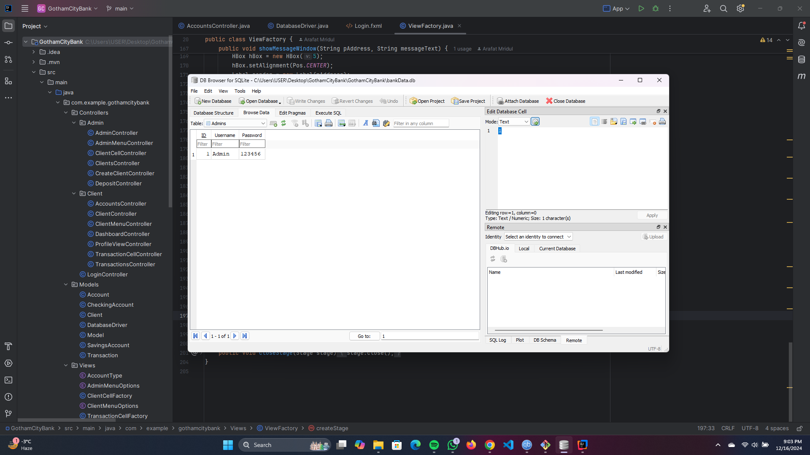
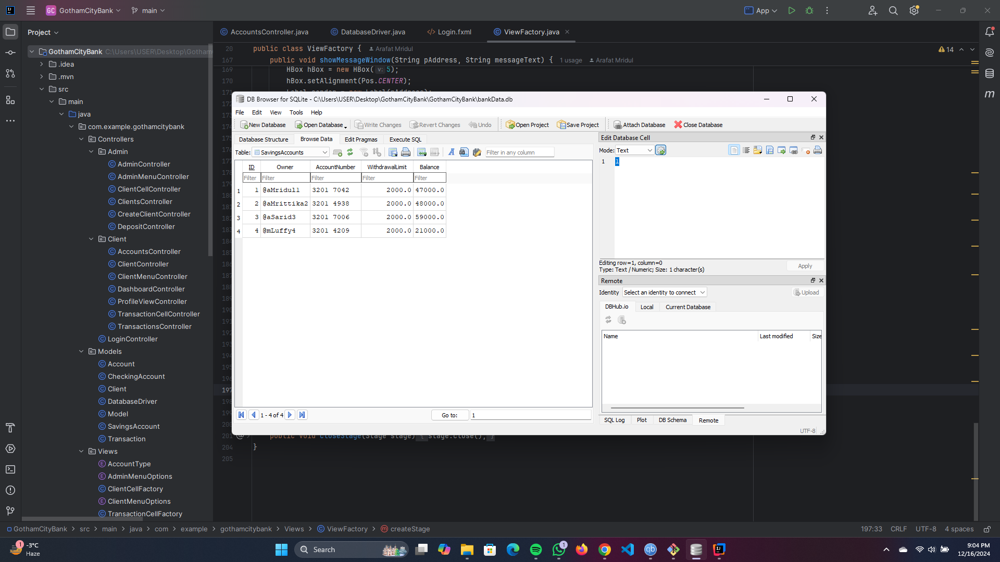
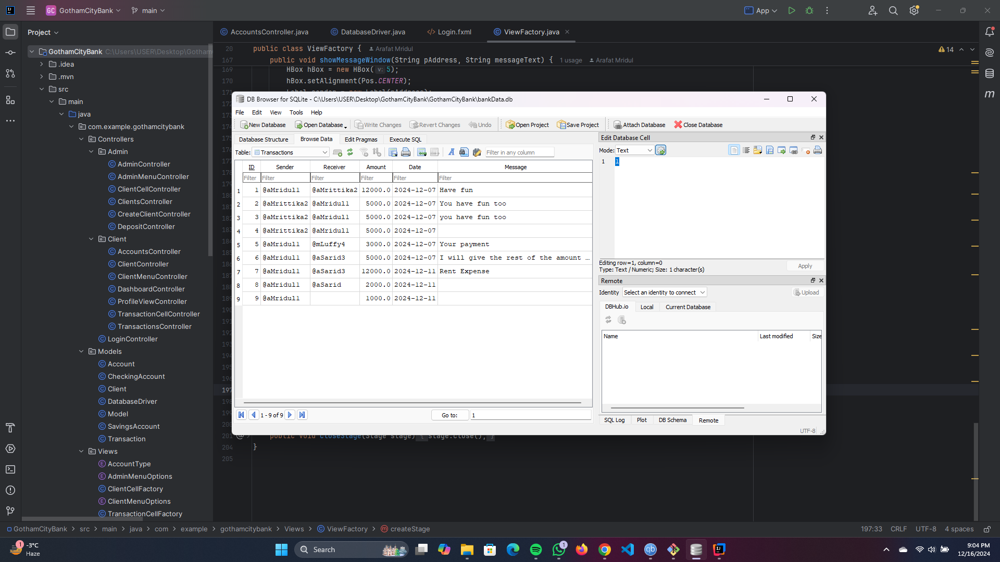

# Bank App

## Overview

This application is a JavaFX-based banking system that provides separate functionalities for clients and administrators. It offers a user-friendly interface for managing accounts, transactions, and client profiles, with clear distinctions between client and admin capabilities.

---

## Features

### Login Menu

- **Client Login:** Access client-specific functionalities.
- **Admin Login:** Access administrative functionalities.

---

### Client Section

#### 1. Dashboard

- Displays balances for both checking and savings accounts.
- Shows a list of the 4 most recent transactions.
- Highlights income and expenses.
- Allows sending money to other clients by entering:
  - Payee address.
  - Amount.
  - Optional message.

#### 2. Transactions

- Maintains a record of all transactions:
  - Transactions sent by the client.
  - Transactions received by the client.

#### 3. Accounts

- Displays detailed information about the checking and savings accounts.
- Allows transferring money between accounts:
  - From checking to savings.
  - From savings to checking.

#### 4. Profile

- Shows detailed client information, including:
  - First name.
  - Last name.
  - Account number.
  - Other relevant details.

#### 5. Logout

- Logs out the current client session.

---

### Admin Section

#### 1. Create Client

- Create a new client by providing:
  - First name and last name.
  - Automatically generates a unique payee address based on:
    - First letter of the first name.
    - Full last name.
    - Client number.
  - Initial balances for checking and savings accounts.

#### 2. Deposit

- Search for a client using the payee address.
- Deposit money into the client’s savings account if the client is found.

#### 3. Clients

- Displays a list of all clients, including:
  - First name and last name.
  - Savings account number.
  - Checking account number.
- Includes a delete button (not yet implemented) for future updates.

#### 4. Logout

- Logs out the current admin session.

---

## Future Improvements

- **Delete Client Functionality:** Implement the ability to delete a client from the system.
- **Enhanced Security:** Add encryption for sensitive data such as passwords and transactions.
- **Comprehensive Testing:** Include test cases for all functionalities.
- **Improved UI:** Enhance the user interface for a better user experience.

---

## How to Run

1. Clone the repository:
   ```bash
   git clone https://github.com/your-username/Bank-App.git
   ```
2. Open the project in IntelliJ IDEA.
3. Ensure JavaFX is properly configured.
4. Run the application from the main class.

---

## Technologies Used

- **JavaFX**: For building the graphical user interface.
- **Java**: Backend logic and functionality.
- **Database**: SQLite for the database.
- **IntelliJ IDEA**: Development environment.

---

## SCREENSHOTS

## Client Section

### Client Login Menu


### Client Credentials


### Client Dashboard


### Client Transactions


### Client Accounts


### Client Profile



## Admin Section

### Admin Login Menu


### Admin Create Client Menu


### Admin Clients Menu


### Admin Desposit Menu


## Database format

### DataBase


### DataBase Admin


### DataBase Clients


### DataBase Savings Account


### DataBase Checking Account


### DataBase Transactions


---

## Author

Developed by [Arafat Mridul](https://github.com/ArafatMridul).

